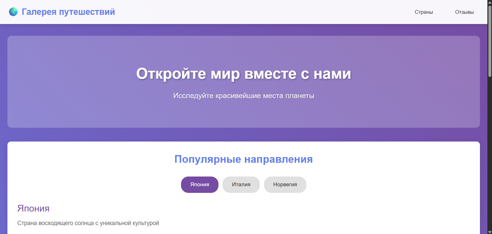
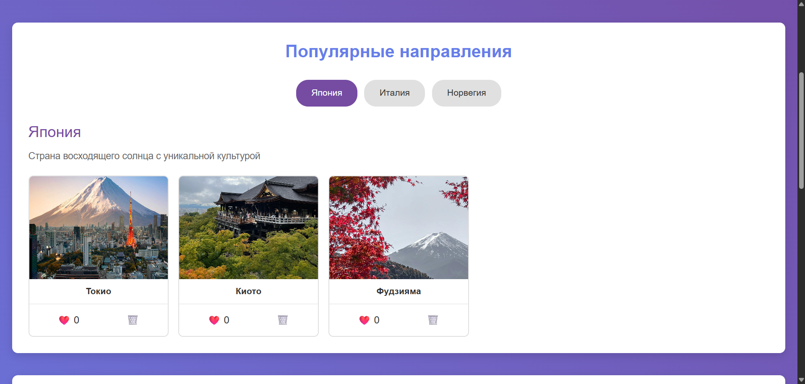
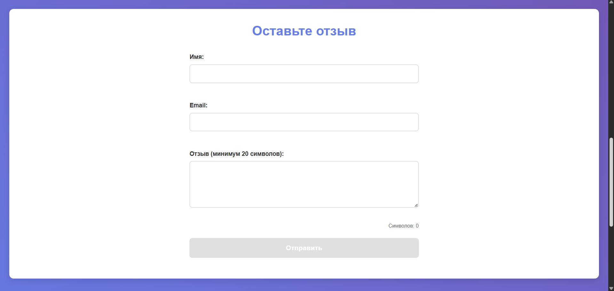

# Лабораторная работа №02

<p align="center">Министерство образования Республики Беларусь</p>
<p align="center">Учреждение образования</p>
<p align="center">"Брестский Государственный технический университет"</p>
<p align="center">Кафедра ИИТ</p>
<br><br><br><br><br><br>
<p align="center"><strong>Лабораторная работа №02</strong></p>
<p align="center"><strong>По дисциплине:</strong> "Веб-технологии"</p>
<p align="center"><strong>Тема:</strong> DOM и события: интерактивные компоненты и формы</p>
<br><br><br><br><br><br>
<p align="right"><strong>Выполнил:</strong></p>
<p align="right">Студент 4 курса</p>
<p align="right">Группы АС-64</p>
<p align="right">Бурак И. Э.</p>
<p align="right"><strong>Проверил:</strong></p>
<p align="right">Несюк А. Н.</p>
<br><br><br><br><br>
<p align="center"><strong>Брест 2025</strong></p>

---

## Цель работы

Освоить работу с DOM: добавление, удаление и изменение элементов интерфейса. Научиться обрабатывать события, использовать делегирование, работать с клавиатурной доступностью. Реализовать дружелюбную клиентскую валидацию форм.

---

### Вариант №29

**Тема:** Галерея путешествий: табы стран, модалка фото, форма отзыва.

## Ход выполнения работы

### 1. Структура проекта

```text
+---doc
|   |   README.md
|   |
|   \---screenshots
|           screenshot1.png
|           screenshot2.png
|           screenshot3.png
|           lighthouse.png
|
\---src
    |   index.html
    |   styles.css
    |   script.js
    |
    \---img
            japan1.jpg
            japan2.jpg
            japan3.jpg
            italy1.jpg
            italy2.jpg
            norway1.jpg
            norway2.jpg
```

- `index.html` — основная страница с разметкой
- `styles.css` — стилизация и медиазапросы
- `script.js` — JavaScript для интерактивности
- `img/` — изображения для галереи

### 2. Реализованные элементы

**Интерактивные компоненты:**

- Табы стран (Япония, Италия, Норвегия) с переключением контента
- Модальное окно для просмотра фотографий в полном размере
- Аккордеон с часто задаваемыми вопросами
- Форма отзыва с валидацией полей

**Функциональность:**

- Делегирование событий для галереи (лайки и удаление карточек)
- Клиентская валидация формы (имя, email, сообщение от 20 символов)
- Счетчик символов в текстовом поле
- Управление с клавиатуры (Escape для закрытия модального окна)
- Адаптивная верстка с медиазапросами (mobile-first)

**Валидация формы:**

- Поле "Имя" — обязательное
- Поле "Email" — проверка на наличие @ и точки
- Поле "Отзыв" — минимум 20 символов
- Кнопка отправки активируется только при валидной форме
- Отображение ошибок в реальном времени

### 3. Скриншоты выполненой лабораторной работы

**Главная страница:**



**Табы с разными странами:**



**Форма отзыва:**



## Проверка качества

### Lighthouse


**Результаты Lighthouse:**

- Performance: 92
- Accessibility: 86
- Best Practices: 85
- SEO: 89

### Валидаторы

- HTML Validator: присутствуют незначительные предупреждения
- CSS Validator: валидация пройдена с предупреждениями

---

## Таблица критериев

| Критерий                                | Баллы | Выполнено |
|------------------------------------------|-------|-----------|
| Семантика/структура и UX-основы | 20 | ✅ |
| Функциональность (компоненты + форма + делегирование) | 25 | ✅ |
| Качество интерфейса: адаптивность/стили/поведение | 20 | ✅ |
| Качество кода: читаемость, структура, модули | 15 | ⚠️ |
| Тесты/валидность/качество | 10 | ⚠️ |
| Публикация и отчёт | 10 | ✅ |

### Дополнительные бонусы

| Бонус                                     | Выполнено |
|-------------------------------------------|-----------|
| Сохранение состояния в localStorage       | ❌ |
| Тёмная тема (prefers-color-scheme)        | ❌ |
| Юнит-тесты на чистые функции              | ❌ |

---

## Вывод

В ходе выполнения лабораторной работы была создана интерактивная веб-страница "Галерея путешествий" с использованием чистого JavaScript. Реализованы основные интерактивные компоненты: табы для переключения между странами, модальное окно для просмотра фотографий, аккордеон с FAQ и форма с клиентской валидацией.

Освоены навыки работы с DOM, обработки событий и делегирования. Реализована адаптивная верстка с использованием медиазапросов. Форма включает валидацию полей в реальном времени с отображением ошибок пользователю.

Использованные технологии: HTML5, CSS3, JavaScript (ES6+). Проект полностью функционален и готов к использованию.
