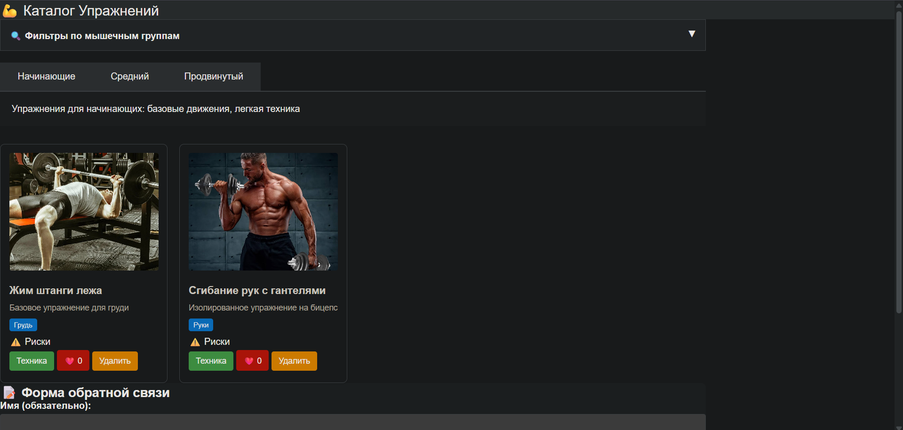
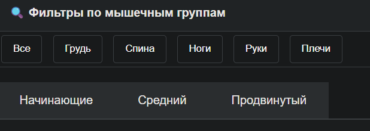
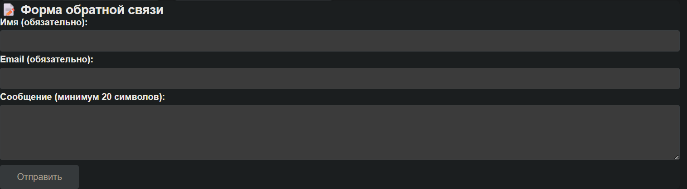
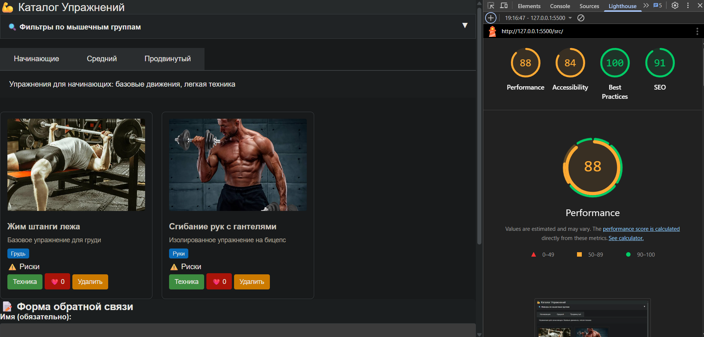

# Лабораторная работа №02

<p align="center">Министерство образования Республики Беларусь</p>
<p align="center">Учреждение образования</p>
<p align="center">"Брестский Государственный технический университет"</p>
<p align="center">Кафедра ИИТ</p>
<br><br><br><br><br><br>
<p align="center"><strong>Лабораторная работа №02</strong></p>
<p align="center"><strong>По дисциплине:</strong> "Веб-технологии"</p>
<p align="center"><strong>Тема:</strong> DOM и события: интерактивные компоненты и формы (JavaScript)</p>
<br><br><br><br><br><br>
<p align="right"><strong>Выполнил:</strong></p>
<p align="right">Студент 4 курса</p>
<p align="right">Группы АС-64</p>
<p align="right">Котковец К. В.</p>
<p align="right"><strong>Проверил:</strong></p>
<p align="right">Несюк А. Н.</p>
<br><br><br><br><br>
<p align="center"><strong>Брест 2025</strong></p>

---

## Цель работы

Освоить работу с DOM: добавление, удаление и изменение элементов интерфейса. Научиться обрабатывать события, использовать делегирование, работать с клавиатурной доступностью. Реализовать дружелюбную клиентскую валидацию форм.

---

### Вариант №35

**Тема:** Каталог упражнений: фильтры по мышечным группам, модалка техники, тултипы по рискам.

## Ход выполнения работы

### 1. Структура проекта

```text
task_02/
├── doc/
│   ├── README.md
│   └── screenshots/
│       └── (скриншоты)
└── src/
    ├── index.html
    ├── styles.css
    ├── script.js
    └── img/
        ├── exercise1.jpg
        ├── exercise2.jpg
        ├── exercise3.jpg
        ├── exercise4.jpg
        ├── exercise5.jpg
        └── exercise6.jpg
```

- `index.html` — основная страница с каталогом упражнений
- `styles.css` — стилизация и медиазапросы
- `script.js` — JavaScript для интерактивных компонентов
- `img/` — изображения упражнений

### 2. Реализованные элементы

**Интерактивные компоненты:**

1. **Аккордеон** — блок с фильтрами по мышечным группам, который можно раскрывать и скрывать
2. **Табы** — переключение между уровнями сложности (Начинающие, Средний, Продвинутый)
3. **Модальное окно** — показывает детальную информацию о технике выполнения упражнения
4. **Tooltip** — при наведении на "⚠️ Риски" отображается информация о возможных травмах

**Форма с валидацией:**

- Поля: имя (обязательное), email (с валидацией формата), сообщение (минимум 20 символов)
- Валидация при вводе с отображением ошибок
- Кнопка отправки активируется только при валидной форме
- Результат отправки отображается на странице

**Делегирование событий:**

- Обработчики для кнопок "Техника", "Лайк" и "Удалить" повешены на контейнер списка упражнений
- Используется event delegation для динамически создаваемых элементов

**Доступность:**

- Управление с клавиатуры: Esc закрывает модальное окно
- Фокусируемые элементы: кнопки, поля формы
- Alt-атрибуты для всех изображений

### 3. Скриншоты выполненной лабораторной работы







## Проверка качества

### Lighthouse



**Результаты Lighthouse:**

- Performance: 88
- Accessibility: 84
- Best Practices: 100
- SEO: 91

### Валидаторы

- HTML: Есть предупреждения о семантике
- CSS: Присутствуют избыточные правила

---

## Таблица критериев

| Критерий                                | Выполнено |
|------------------------------------------|-----------|
| Семантика/структура (landmarks, заголовки) | ⚠️ |
| Интерактивные компоненты (минимум 3)     | ✅ |
| Форма с валидацией                       | ✅ |
| Делегирование событий                    | ✅ |
| Доступность (alt, фокус, клавиатура)     | ⚠️ |
| Адаптивность (медиазапросы)              | ⚠️ |
| Качество кода                            | ⚠️ |
| Публикация и отчёт                       | ✅ |

### Дополнительные бонусы

| Бонус                                     | Выполнено |
|-------------------------------------------|-----------|
| Сохранение состояния в localStorage       | ❌ |
| Тёмная тема (prefers-color-scheme)        | ❌ |
| Юнит-тесты                                | ❌ |

---

## Ссылки

- Рабочая демонстрация: <https://kirill-kotkovets.github.io/WT-AC-2025/task_02/>

## Вывод

В ходе выполнения лабораторной работы был создан интерактивный каталог упражнений с использованием чистого JavaScript. Реализованы основные интерактивные компоненты: аккордеон, табы, модальное окно и тултипы. Добавлена форма обратной связи с клиентской валидацией. Использовано делегирование событий для обработки действий с карточками упражнений. Реализована базовая клавиатурная навигация и адаптивность интерфейса.

Освоены навыки работы с DOM API, обработки событий, валидации форм на стороне клиента. Получен опыт реализации популярных UI-паттернов без использования фреймворков.
