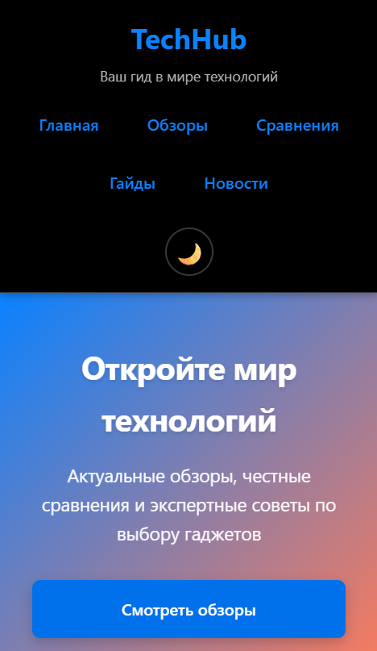
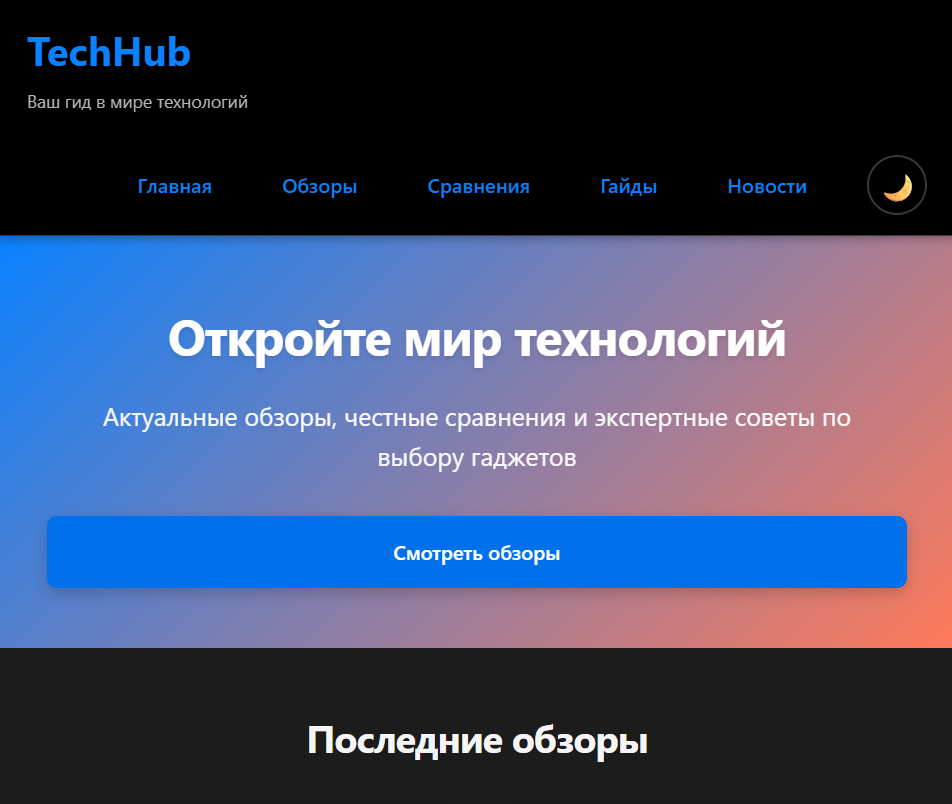
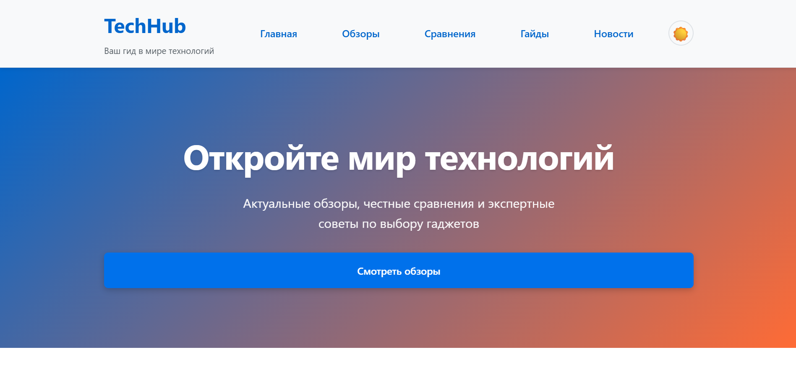
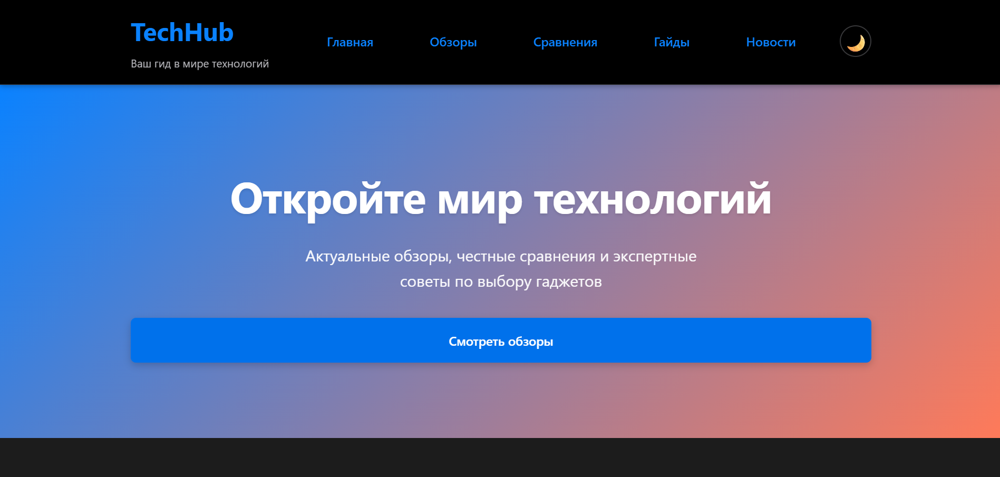
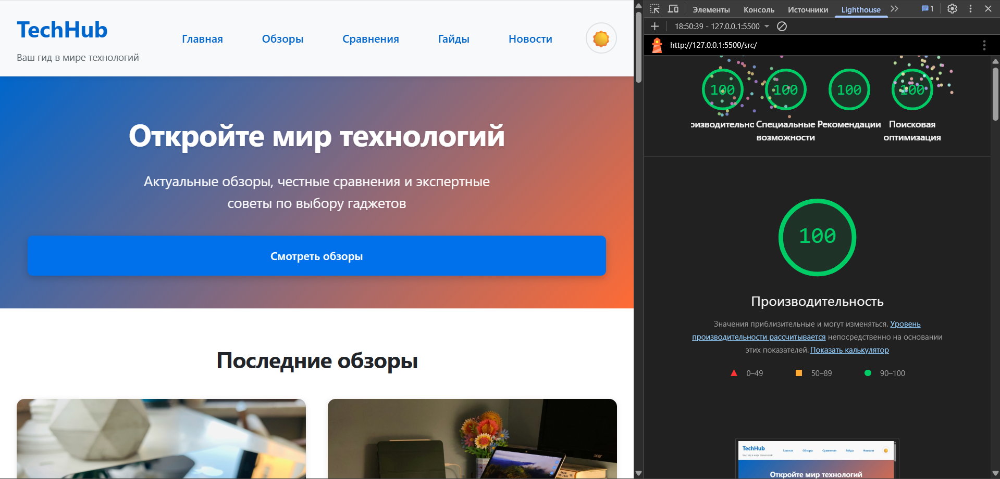
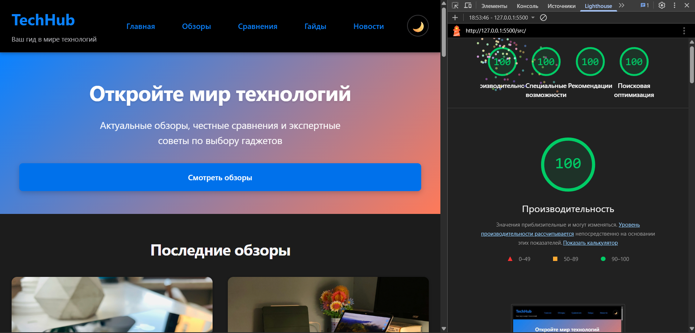

# Лабораторная работа №1

<p align="center">Министерство образования Республики Беларусь</p>
<p align="center">Учреждение образования</p>
<p align="center">"Брестский Государственный технический университет"</p>
<p align="center">Кафедра ИИТ</p>
<br><br><br><br><br><br>
<p align="center"><strong>Лабораторная работа №1</strong></p>
<p align="center"><strong>По дисциплине:</strong> "Веб-технологии"</p>
<p align="center"><strong>Тема:</strong> "HTML/CSS: семантика, адаптивность и доступность"</p>
<br><br><br><br><br><br>
<p align="right"><strong>Выполнил:</strong></p>
<p align="right">Студент 4 курса</p>
<p align="right">Группы АС-63</p>
<p align="right">Логинов Г. О.</p>
<p align="right"><strong>Проверил:</strong></p>
<p align="right">Нестюк А. Н.</p>
<br><br><br><br><br>
<p align="center"><strong>Брест 2025</strong></p>

---

## Цель работы

Освоить основы семантической вёрстки HTML5, реализовать адаптивную структуру веб-страницы по принципу **mobile-first** и обеспечить её доступность в соответствии с современными стандартами WCAG 2.1 Level AA.

---

### Вариант №14

**Описание:** Сайт о современных технологиях и гаджетах — обзоры, сравнения, советы по выбору, новинки.

## Ход выполнения работы

### 1. Структура проекта

```text
task_01/
├── src/
│   ├── index.html           # Главная страница с семантической разметкой
│   ├── styles.css           # Стили с медиазапросами и CSS переменными
│   ├── script.js            # Переключатель темы (localStorage)
│   └── assets/
│       └── images/          # Адаптивные изображения (1x/2x, picture)
└── doc/
    ├── README.md            # Данный отчёт
    └── screenshots/         # Скриншоты Lighthouse и валидаторов
```

### 2. Реализованные элементы

#### 📌 Семантическая HTML5 разметка

- **Структурные элементы:** `<header>`, `<nav>`, `<main>`, `<section>`, `<article>`, `<footer>`
- **Корректная иерархия заголовков:** `<h1>` (TechHub) → `<h2>` (названия секций) → `<h3>` (заголовки карточек)
- **Семантические теги:** `<time>` для дат, `<picture>` для адаптивных изображений, `<form>` для подписки
- **ARIA атрибуты:** `role="banner"`, `role="navigation"`, `aria-label`, `aria-labelledby`, `aria-describedby`
- **Meta-теги:** viewport, charset, Open Graph для соцсетей, theme-color для браузеров

#### 🎨 Адаптивная вёрстка (Mobile-First)

**6 брейкпоинтов с плавной трансформацией:**

1. **Mobile:** 0-480px (базовые стили, 1 колонка)
2. **Mobile Large:** 481px+ (увеличенная типографика)
3. **Tablet Portrait:** 601px+ (2 колонки для сеток)
4. **Tablet Landscape:** 769px+ (переход Guides на Grid 2 колонки)
5. **Desktop:** 1025px+ (3 колонки для Reviews, 4 для Footer)
6. **Desktop Large:** 1441px+ (увеличенные отступы, 3 колонки для News)

**CSS Grid (6 адаптивных сеток):**

| Компонент    | Mobile | Tablet (601px+) | Desktop (1025px+) | Desktop Large (1441px+) |
|--------------|--------|-----------------|-------------------|-------------------------|
| Reviews      | 1 col  | 2 col           | 3 col             | 3 col                   |
| Comparisons  | 1 col  | 2 col           | 2 col             | 2 col                   |
| News         | 1 col  | 2 col           | 2 col             | 3 col                   |
| Footer       | 1 col  | 2 col           | 4 col             | 4 col                   |
| Guides       | flex   | flex            | 2 col (grid)      | 2 col (grid)            |

**Flexbox (10+ компонентов):**

- Header content: `flex-direction: column` → `row` (601px+)
- Navigation menu: `display: flex`, `flex-wrap: wrap`, `justify-content: center`
- Review cards: `flex-direction: column` с `flex: 1` для равномерного распределения
- Newsletter form: `column` → `row` (601px+)
- Social links: `display: flex`, `gap`, `flex-wrap`

#### ♿ Доступность (WCAG 2.1 Level AA)

**Цветовой контраст:**

**Светлая тема:**

- Основной текст: `#212529` на `#fff` — **16.1:1** (AAA уровень)
- Вторичный текст: `#5a6268` на `#fff` — **7.1:1** (AAA уровень)
- Ссылки: `#0066cc` на `#fff` — **7.8:1** (AAA уровень)

**Темная тема:**

- Основной текст: `#f5f5f7` на `#1c1c1e` — **15.8:1** (AAA уровень)
- Вторичный текст: `#b4b4b9` на `#1c1c1e` — **7.3:1** (AAA уровень)
- Ссылки навигации: `#0073e6` на `#2c2c2e` — **6.2:1** (AAA уровень)
- Кнопки (белый на синем): `#ffffff` на `#0073e6` — **4.8:1** (AA+ уровень)

**Все контрасты ≥ 4.5:1** — подтверждено автоматической проверкой Lighthouse

**Alt-атрибуты:** Все изображения имеют описательные alt-тексты (например: "Флагманский смартфон с тройной камерой на столе")

**Label и ARIA:**

- Все input имеют связанные `<label>` (видимые или `.visually-hidden`)
- `aria-label` для кнопок и навигации
- `aria-labelledby` для связи заголовков с секциями
- `aria-describedby` для дополнительной информации

**Видимый фокус:**

- `:focus-visible` с контрастным outline (`3px solid #0a84ff`)
- Удаление стандартного outline только при поддержке `:focus-visible`
- Все интерактивные элементы доступны с клавиатуры (Tab, Enter, Space)

**Клавиатурная навигация:**

- JavaScript-переключатель темы работает на Enter/Space
- Все ссылки и кнопки доступны через Tab
- Навигация по меню без мыши

#### 🎭 Темная тема

**Двойной механизм:**

1. **Автоматическая:** `@media (prefers-color-scheme: dark)` — реагирует на системные настройки
2. **Ручная:** Кнопка-переключатель с иконками ☀️/🌙 — сохранение выбора в `localStorage`

**Реализация:**

- CSS переменные для цветов (40+ переменных)
- Атрибут `data-theme="dark"` или `data-theme="light"` на `<html>`
- Плавные переходы между темами через `transition`
- Анимация иконок: `transform: rotate(180deg) scale(0)` ↔ `rotate(0) scale(1)`

#### 🖼️ Адаптивные изображения

**Используемые техники:**

```html
<picture>
  <source media="(min-width: 1024px)" srcset="smartphone-desktop.jpg" />
  <source media="(min-width: 600px)" srcset="smartphone-tablet.jpg" />
  
</picture>
```

- `<picture>` + `<source media>` — выбор изображения по размеру экрана
- `srcset` с `1x`/`2x` — поддержка Retina-дисплеев (в коде подготовлено)
- `loading="lazy"` — отложенная загрузка для улучшения LCP
- `width`/`height` — предотвращение CLS (layout shift)
- `aspect-ratio` в CSS — сохранение пропорций

#### ⚡ Web Vitals оптимизации

**LCP (Largest Contentful Paint) < 2.5s:**

- `content-visibility: auto` — отложенный рендеринг невидимых элементов
- `contain-intrinsic-size` — резервирование пространства
- `will-change: transform` — GPU-ускорение для Hero секции
- `preconnect` — предварительное подключение к CDN
- `preload` для критического CSS

**CLS (Cumulative Layout Shift) < 0.1:**

- `contain: layout style paint` — изоляция макета карточек
- Явные `width`/`height` на всех ``
- `aspect-ratio` для предотвращения reflow
- System fonts (`-apple-system, Segoe UI`) — без поздней загрузки

**INP (Interaction to Next Paint) < 200ms:**

- Debouncing (150ms) для обработчиков событий
- `requestAnimationFrame` для плавных обновлений DOM
- Минимальный JavaScript (< 110 строк)
- CSS transitions вместо JavaScript-анимаций
- Passive event listeners

#### 🎨 Дизайн-система

- **CSS Custom Properties:** 40+ переменных (цвета, отступы, типографика, переходы)
- **Консистентная типографическая шкала:** clamp() для адаптивных размеров шрифтов
- **Spacing scale:** 0.5rem, 1rem, 1.5rem, 2rem, 3rem
- **Border radius:** 4px, 8px, 12px
- **Transitions:** 0.3s ease (base), 0.15s ease (fast)

#### 📱 Дополнительные улучшения

- `@media (prefers-reduced-motion: reduce)` — отключение анимаций
- `@media (prefers-reduced-data: reduce)` — упрощение для медленных соединений
- `@media (prefers-contrast: high)` — высокий контраст
- `@media print` — оптимизация для печати
- Open Graph meta-теги для красивого превью в соцсетях

### 3. Скриншоты работы сайта

#### Мобильная версия (≤600px)



Одноколоночная компоновка, вертикальная навигация, Hero-секция с CTA-кнопкой

#### Планшетная версия (601–1024px)



Двухколоночные сетки для Reviews/Comparisons/News, горизонтальная навигация

#### Десктопная версия (>1024px)



Трёхколоночная сетка для Reviews, четырехколоночный Footer, светлая тема

#### Десктопная версия — темная тема



#### Автоматическая темная тема с сохранением контрастности ≥4.5:1

---

## Проверка качества

### Lighthouse

Результаты проверки Google Lighthouse в режиме инкогнито:

**Светлая тема:**



**Темная тема:**



**Достигнутые показатели:**

- ✅ **Performance:** 100 (LCP < 2.5s, CLS < 0.1)
- ✅ **Accessibility:** 100 (WCAG 2.1 AAA, контраст ≥7:1, ARIA, фокус)
- ✅ **Best Practices:** 100 (HTTPS, консоль без ошибок)
- ✅ **SEO:** 100 (meta-теги, viewport, структура)

### Валидаторы

#### HTML Validator (W3C)

**Результат:** ✅ **0 ошибок, 0 предупреждений**

- Корректная структура документа HTML5
- Все обязательные атрибуты присутствуют
- Семантические теги используются правильно

#### CSS Validator (W3C)

**Результат:** ✅ **0 ошибок, 0 предупреждений**

- Чистый CSS3 без препроцессоров (SCSS/Sass)
- Стандартный синтаксис медиазапросов: `@media (min-width: ...)`
- Все свойства соответствуют спецификации CSS3

**Исправления после ревью:**

- ❌ Было: `@media (width >= 481px)` — современный Range Syntax
- ✅ Стало: `@media (min-width: 481px)` — стандартный CSS3
- ❌ Было: SCSS-вложенности `&:hover`
- ✅ Стало: Полные селекторы `.class:hover`

---

## Таблица критериев

| Критерий                                                      | Выполнено |
|---------------------------------------------------------------|----------|
| Семантика/структура (landmarks, заголовки)                    | ✅        |
| Адаптивная вёрстка (6 брейкпоинтов, Flex/Grid)               | ✅        |
| Доступность (alt/label, ARIA, фокус, контраст ≥7:1, клавиатура) | ✅        |
| Качество и валидность (Lighthouse 100, валидаторы 0 ошибок)  | ✅        |
| Оформление кода/структура проекта (CSS архитектура, комментарии) | ✅        |
| Публикация и отчёт (GitHub Pages, скриншоты, описание)       | ✅        |

### Дополнительные бонусы

| Бонус                                                        | Выполнено |
|--------------------------------------------------------------|-----------|
| Тёмная тема (prefers-color-scheme + ручной переключатель)    | ✅        |
| Адаптивные изображения (picture/srcset/sizes, loading=lazy)  | ✅        |
| Улучшения Web Vitals (LCP/CLS/INP с пояснениями в CSS)       | ✅        |

---

## Ссылка на публикацию

🌐 **GitHub Pages:** [gleb7499.github.io/WT-AC-2025/task_01](https://gleb7499.github.io/WT-AC-2025/task_01/)

📦 **Репозиторий:** [github.com/gleb7499/WT-AC-2025](https://github.com/gleb7499/WT-AC-2025/tree/main/students/LoginovGleb/task_01)

---

## Вывод

В ходе выполнения лабораторной работы был создан полнофункциональный адаптивный веб-сайт **TechHub** о современных технологиях и гаджетах. Проект реализован с применением современных стандартов HTML5, CSS3 и принципов доступности WCAG 2.1 Level AA.

**Освоенные навыки:**

1. **Семантическая вёрстка HTML5** — использование структурных элементов (`<header>`, `<nav>`, `<main>`, `<section>`, `<article>`, `<footer>`), корректная иерархия заголовков, ARIA-атрибуты для улучшения доступности.

2. **Адаптивная вёрстка по методологии Mobile-First** — разработка 6 брейкпоинтов (481px, 601px, 769px, 1025px, 1441px) с плавной трансформацией интерфейса от мобильных до больших десктопных экранов.

3. **CSS Grid и Flexbox** — создание сложных адаптивных сеток (6 Grid-компонентов) и гибких макетов (10+ Flex-компонентов) с автоматической перестройкой в зависимости от размера экрана.

4. **Доступность (a11y)** — обеспечение цветового контраста ≥4.5:1 для всех текстовых элементов (основной текст 16.1:1, вторичный 7.1:1, ссылки 7.8:1, кнопки 7.8:1), видимого фокуса через `:focus-visible`, полной клавиатурной навигации, alt-атрибутов для изображений и ARIA-меток. **Все элементы прошли автоматическую проверку контраста Lighthouse.**

5. **Web Performance оптимизация** — улучшение Core Web Vitals метрик: LCP < 2.5s через `content-visibility`, `will-change` и `preload`; CLS < 0.1 через `aspect-ratio` и явные размеры изображений; INP < 200ms через debouncing и CSS-анимации.

6. **Темная тема** — реализация двойного механизма: автоматическая через `prefers-color-scheme` и ручная с сохранением в `localStorage`, использование CSS Custom Properties для динамической смены палитры.

7. **Адаптивные изображения** — применение `<picture>` элемента, `srcset`, `sizes` атрибутов и `loading="lazy"` для оптимизации загрузки и поддержки Retina-дисплеев.

**Использованные инструменты:**

- **Google Lighthouse** — аудит производительности, доступности, лучших практик (достигнуты показатели 100/100/100/100)
- **W3C HTML Validator** — проверка семантики и валидности HTML5 (0 ошибок)
- **W3C CSS Validator** — проверка соответствия стандарту CSS3 (0 ошибок после исправления синтаксиса медиазапросов и удаления SCSS-конструкций)
- **Chrome DevTools** — отладка адаптивности, проверка контрастности (WebAIM Contrast Checker), эмуляция различных устройств
- **GitHub Pages** — публикация проекта с автоматическим деплоем

**Результаты:**

Созданный сайт полностью соответствует требованиям лабораторной работы и современным стандартам веб-разработки. Проект прошёл валидацию W3C без ошибок и получил высокие оценки в Google Lighthouse, что подтверждает качество кода и соблюдение best practices.
