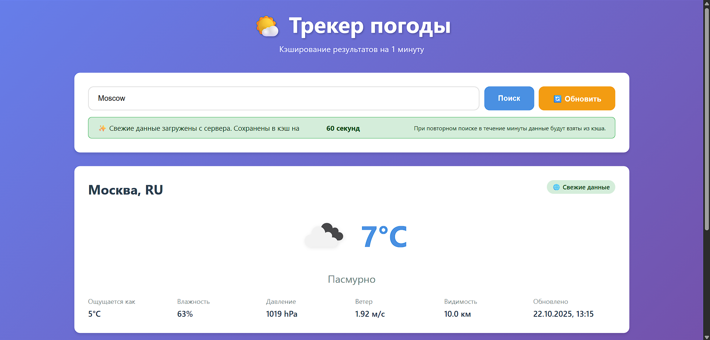
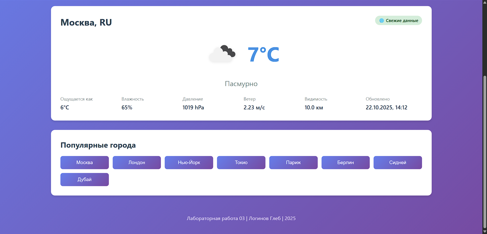
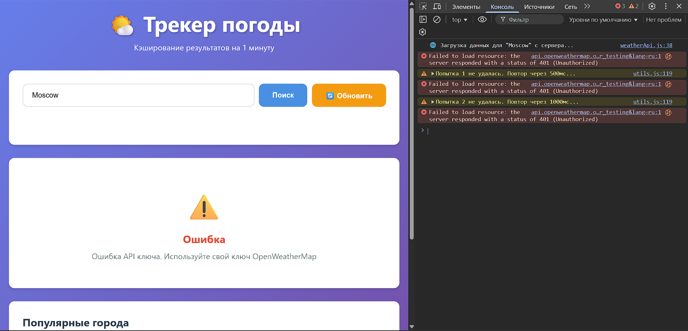
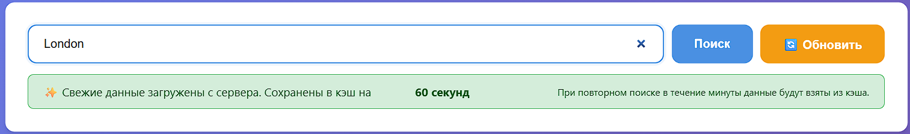
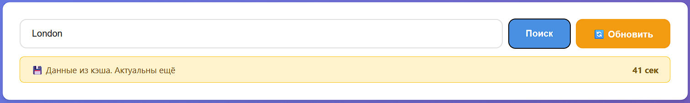
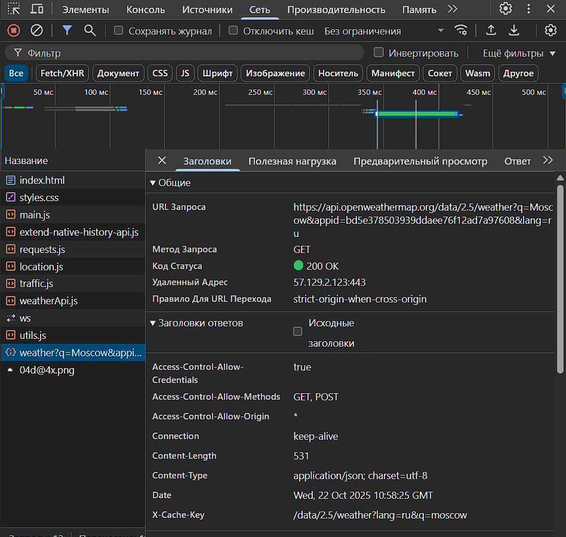
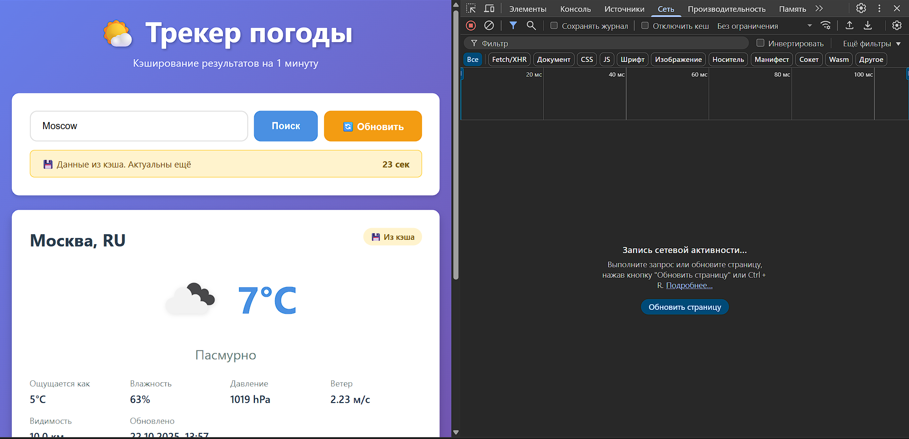
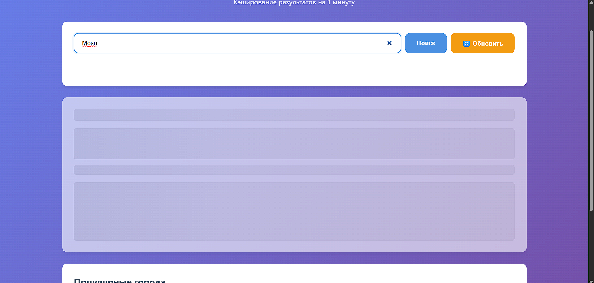
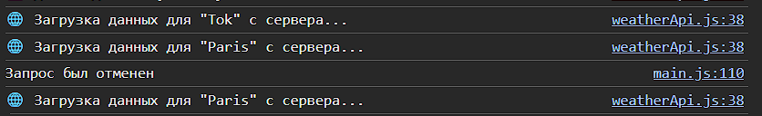

# Лабораторная работа 03. Трекер погоды с кэшированием

**Автор:** Логинов Глеб  
**Вариант:** Трекер погоды по городам с кэшированием результатов на 1 минуту  
**Публикация:** [Ссылка на GitHub Pages] <!-- TODO: Добавить после деплоя -->

---

## Описание проекта

Веб-приложение для отслеживания погоды в городах мира с использованием OpenWeatherMap API. Приложение демонстрирует работу с асинхронными операциями, HTTP-кэшированием, обработкой ошибок и управлением состояниями.

### Основные возможности

- 🔍 **Поиск по городам** с debounce и валидацией
- 💾 **In-memory кэширование** с TTL 60 секунд
- 🔄 **Retry-механизм** с экспоненциальным backoff
- ⏱️ **Таймауты запросов** (5 секунд)
- ❌ **Отмена запросов** через AbortController
- 📊 **Состояния UI**: loading (skeleton), error, empty, success
- 🌐 **Индикатор кэша**: показывает источник данных и время актуальности

---

## Технологии

- **HTML5** — семантическая разметка
- **CSS3** — адаптивный дизайн, градиенты, анимации
- **JavaScript (ES6+)** — async/await, модули, fetch API
- **OpenWeatherMap API** — данные о погоде
- **Архитектура** — модульная структура (utils, api, main)

---

## Реализованные требования

### 1. Клиент к API ✅

- Использование публичного API (OpenWeatherMap)
- Загрузка данных о погоде для городов
- Поиск с фильтрацией
- Обработка состояний: loading, error, success, empty
- Skeleton loader во время загрузки

**Скриншот:**




### 2. Ретраи и таймауты ✅

Реализована функция `fetchWithRetry` в `utils.js`:

```javascript
export async function fetchWithRetry(url, {
    retries = 2,           // 2 повторные попытки
    backoffMs = 500,       // Начальная задержка 500мс
    timeoutMs = 5000,      // Таймаут 5 секунд
    signal = null          // AbortSignal для отмены
} = {}) { ... }
```

**Особенности:**

- Экспоненциальный backoff: 500мс → 1000мс → 2000мс
- Автоматическая отмена по таймауту
- Комбинирование сигналов (внешний + таймаут)
- Логирование попыток в консоль

**Скриншот:**



### 3. HTTP-кэширование ✅

Реализован класс `CacheWithTTL` в `utils.js`:

**Принцип работы:**

- In-memory кэш на основе Map
- TTL = 60000 мс (1 минута)
- Автоматическая инвалидация просроченных записей
- Информация о времени жизни кэша

**Ключевые методы:**

```javascript
cache.set(key, value)     // Сохранить с TTL
cache.get(key)            // Получить (null если истек)
cache.has(key)            // Проверить актуальность
cache.getCacheInfo(key)   // Информация о кэше
```

**Скриншоты:**









### 4. UX-улучшения ✅

**Реализовано:**

- ✅ **Две кнопки с разной логикой:**
  - **"Поиск"** — умный поиск с использованием кэша (проверяет кэш → если нет/устарел → сервер)
  - **"🔄 Обновить"** — принудительная загрузка с сервера (игнорирует кэш полностью)
- ✅ Индикатор источника данных (💾 кэш / 🌐 сервер)
- ✅ Skeleton loader при загрузке
- ✅ Таймер актуальности кэша в реальном времени
- ✅ Адаптивный дизайн для всех экранов
- ✅ Плавные анимации и transitions
- ✅ Обработка всех типов ошибок (404, timeout, network)

**Скриншот:**


### Состояние загрузки (skeleton)



_Минималистичный скриншот: одна карточка с skeleton-заполнителями. Как получить — см. `doc/screenshots/README.md`, раздел «09_skeleton_loading.png»._

### 5. Управление конкурентными запросами ✅

При каждом новом поиске предыдущий запрос отменяется через AbortController:

```javascript
// Отменяем предыдущий запрос
if (state.currentAbortController) {
    state.currentAbortController.abort();
}

// Создаем новый контроллер
state.currentAbortController = new AbortController();
```

**Скриншот:**



---

## Структура проекта

```text
task_03/
├── src/
│   ├── index.html           # Главная страница
│   ├── styles.css           # Стили приложения
│   └── scripts/
│       ├── main.js          # Главная логика и UI
│       ├── weatherApi.js    # API клиент
│       └── utils.js         # Утилиты (cache, retry, debounce)
├── doc/
│   └── screenshots/
│       └── *.png            # Скриншоты
└── README.md                # Отчет (этот файл)
```

---

## Использование

### Основной сценарий работы с кэшем

1. **Первый поиск города:**
   - Введите название города (например, "Moscow")
   - Нажмите кнопку "Поиск" или Enter
   - Данные загружаются **с сервера**
   - Отображается badge "🌐 Свежие данные"
   - Данные автоматически сохраняются в кэш на **60 секунд**

2. **Повторный поиск того же города (в течение 60 сек):**
   - Введите тот же город снова
   - Нажмите кнопку "Поиск"
   - Данные берутся **из кэша** (без запроса к серверу!)
   - Отображается badge "💾 Из кэша"
   - Показывается таймер: "Актуальны ещё XX сек"

3. **Поиск после истечения кэша (>60 сек):**
   - Кэш автоматически устарел
   - При поиске идет **новый запрос на сервер**
   - Данные снова кэшируются на 60 секунд

4. **Принудительное обновление (игнорирование кэша):**
   - Кнопка "🔄 Обновить" — **всегда** загружает свежие данные с сервера
   - Игнорирует кэш, даже если данные еще актуальны
   - Полезно для получения самых свежих данных

5. **Популярные города:**
   - Клик на кнопку города — работает так же, как обычный поиск
   - Сначала проверяет кэш, потом сервер

### Отмена запросов

- При новом поиске предыдущий запрос автоматически отменяется
- Предотвращает race conditions и экономит ресурсы

---

## Детали реализации

### Кэширование

**Почему in-memory, а не localStorage?**

- TTL 60 секунд — короткий срок, не требует персистентности
- Меньше overhead на сериализацию/десериализацию
- Автоматическая очистка при перезагрузке страницы

**Альтернатива:** Можно легко заменить на localStorage:

```javascript
// В weatherApi.js заменить CacheWithTTL на LocalStorageCache
```

### Retry-механизм

**Параметры по умолчанию:**

- `retries: 2` — всего 3 попытки
- `backoffMs: 500` — начальная задержка
- `timeoutMs: 5000` — таймаут каждой попытки

**Экспоненциальный backoff:**

- 1-я попытка: сразу
- 2-я попытка: +500мс
- 3-я попытка: +1000мс

### Обработка ошибок

**Типы ошибок:**

- **404** — Город не найден
- **401** — Неверный API ключ
- **Timeout** — Превышен таймаут (5 сек)
- **Network** — Сетевая ошибка
- **Abort** — Запрос отменен пользователем

Каждая ошибка обрабатывается отдельно с понятным сообщением.

---

## Выводы

В рамках лабораторной работы успешно реализовано полнофункциональное приложение для отслеживания погоды с акцентом на асинхронность и кэширование:

### Изучено

- ✅ Работа с промисами и async/await
- ✅ Обработка ошибок в асинхронном коде
- ✅ Механизмы retry с exponential backoff
- ✅ Управление таймаутами и отменой запросов
- ✅ In-memory кэширование с TTL
- ✅ Конкурентные запросы и race conditions
- ✅ UX для асинхронных операций

### Ключевые находки

- **Кэширование** значительно улучшает UX и снижает нагрузку на API
- **AbortController** необходим для корректной отмены запросов
- **Exponential backoff** предотвращает DDoS собственного API
- **Skeleton UI** лучше, чем простой спиннер
- **Debounce** критичен для поиска в реальном времени
