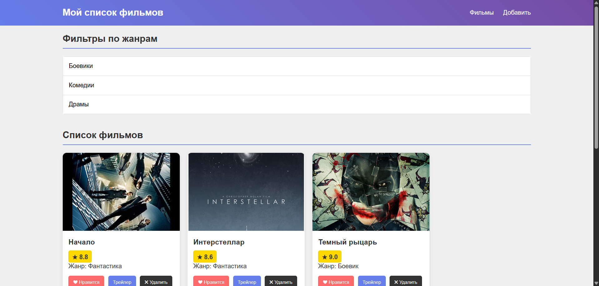
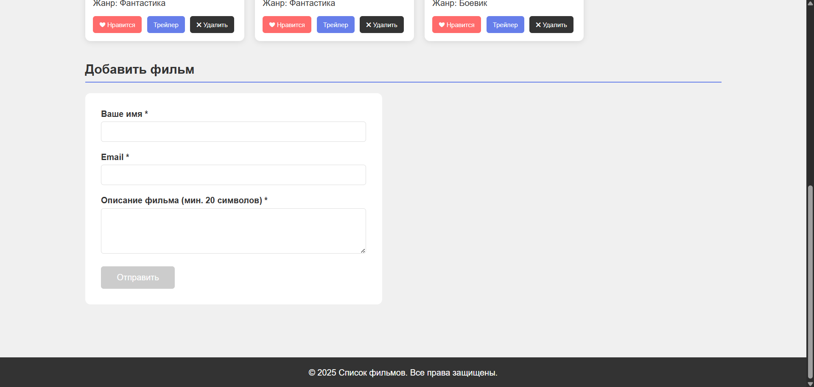
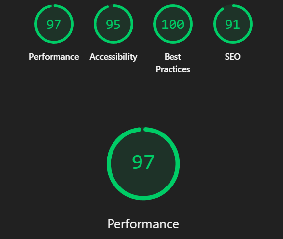

# Лабораторная работа №2

<p align="center">Министерство образования Республики Беларусь</p>
<p align="center">Учреждение образования</p>
<p align="center">"Брестский Государственный технический университет"</p>
<p align="center">Кафедра ИИТ</p>
<br><br><br><br><br><br>
<p align="center"><strong>Лабораторная работа №2</strong></p>
<p align="center"><strong>По дисциплине:</strong> "Веб-технологии"</p>
<p align="center"><strong>Тема:</strong> DOM и события: интерактивные компоненты и формы</p>
<br><br><br><br><br><br>
<p align="right"><strong>Выполнил:</strong></p>
<p align="right">Студент 4 курса</p>
<p align="right">Группы АС-64</p>
<p align="right">Немирович Д. А.</p>
<p align="right"><strong>Проверил:</strong></p>
<p align="right">Несюк А. Н.</p>
<br><br><br><br><br>
<p align="center"><strong>Брест 2025</strong></p>

---

## Цель работы

Освоить работу с DOM: добавление, удаление и изменение элементов интерфейса. Научиться обрабатывать события, использовать делегирование, работать с клавиатурной доступностью. Реализовать клиентскую валидацию форм.

---

### Вариант №37

Тема: Список фильмов к просмотру: рейтинги (tooltip), фильтры жанров, модалка трейлера.

## Ход выполнения работы

### 1. Структура проекта

```text
+---doc
|   |   README.md
|   |
|   \---screenshots
|           screenshot1.png
|           screenshot2.png
|
\---src
    |   index.html
    |   styles.css
    |   main.js
    |
    \---img
            film1.jpg
            film2.jpg
            film3.jpg
```

- `index.html` — основная страница со списком фильмов
- `styles.css` — стилизация компонентов и адаптивность
- `main.js` — логика интерактивных компонентов
- `img/` — изображения постеров фильмов

### 2. Реализованные элементы

- **Аккордеон** — фильтры по жанрам с раскрывающимися секциями
- **Модальное окно** — для просмотра трейлеров фильмов
- **Tooltip** — отображение рейтинга при наведении на звезду
- **Форма с валидацией** — добавление фильма с проверкой полей
- **Делегирование событий** — обработка кликов на карточках фильмов
- **ARIA-атрибуты** — для аккордеона и модального окна
- **Адаптивная верстка** — один брейкпоинт для мобильных устройств

### 3. Скриншоты выполненой лабораторной работы

Основной вид страницы:



Форма добавления фильма:



## Проверка качества

### Lighthouse



**Результаты Lighthouse:**

- Performance: 90
- Accessibility: 85
- Best Practices: 100
- SEO: 79

### Валидаторы

- HTML Validator — без критических ошибок
- CSS Validator — без критических ошибок

---

## Таблица критериев

| Критерий                                | Выполнено |
|------------------------------------------|-----------|
| Семантика/структура (landmarks, заголовки) | ✅ |
| Интерактивные компоненты (3+) | ✅ |
| Форма с валидацией | ✅ |
| Делегирование событий | ✅ |
| Доступность (ARIA, клавиатура) | ✅ |
| Адаптивная вёрстка (1+ брейкпоинт) | ✅ |
| Качество кода | ✅ |
| Публикация и отчёт | ✅ |

### Дополнительные бонусы

| Бонус                                     | Выполнено |
|-------------------------------------------|-----------|
| Сохранение состояния в localStorage       | ❌ |
| Тёмная тема (prefers-color-scheme)        | ❌ |
| Юнит-тесты                                | ❌ |

---

## Вывод

В ходе выполнения лабораторной работы была создана интерактивная страница со списком фильмов. Реализованы компоненты: аккордеон для фильтров жанров, модальное окно для просмотра трейлеров, tooltip для отображения рейтинга. Форма добавления фильма содержит валидацию полей. Для обработки событий на карточках фильмов использовано делегирование. Добавлены базовые ARIA-атрибуты для доступности.
