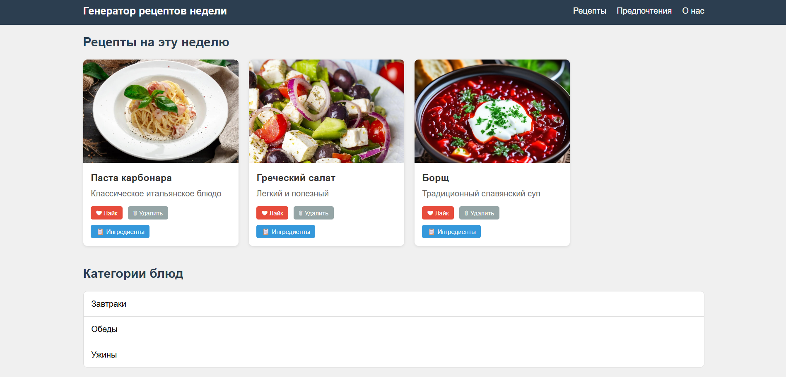
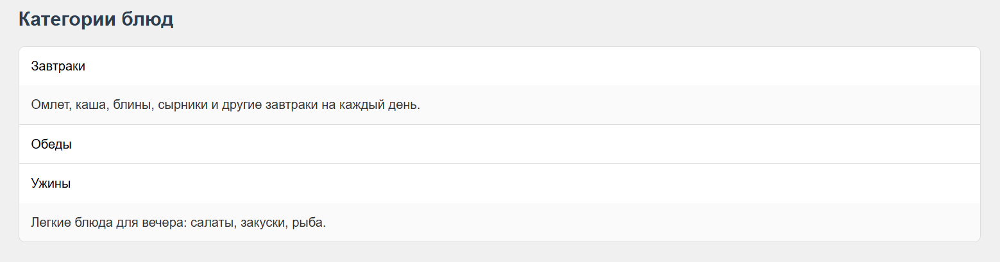
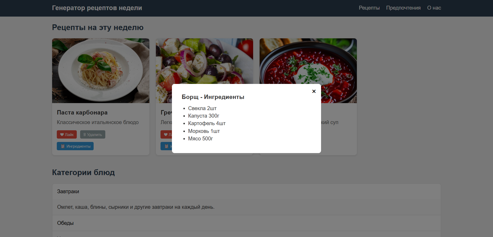
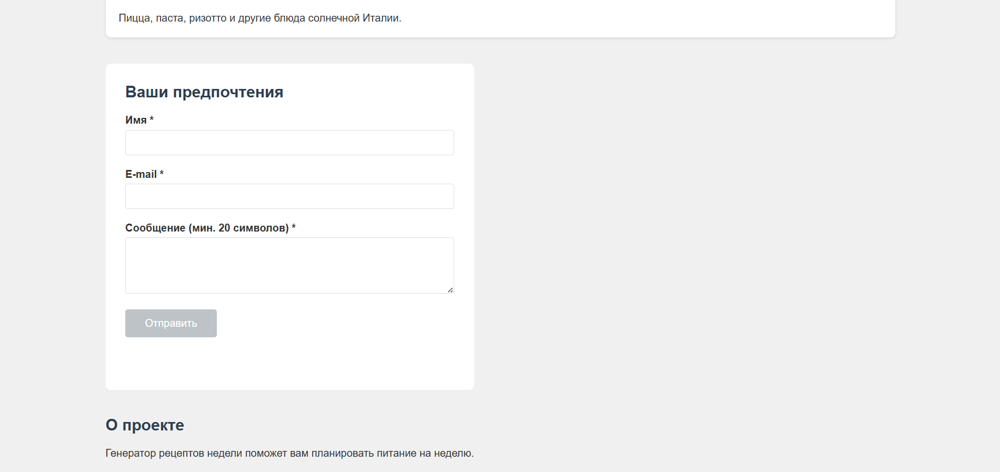
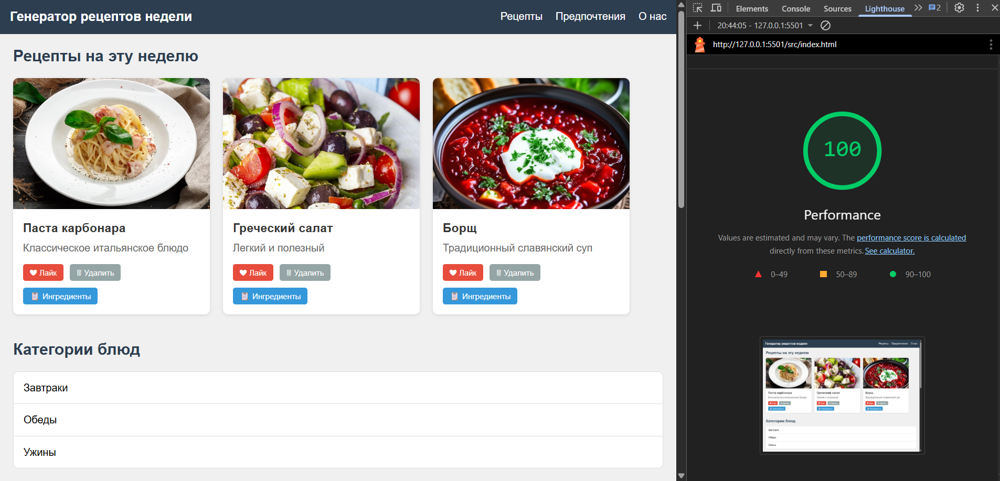

# Лабораторная работа №02

<p align="center">Министерство образования Республики Беларусь</p>
<p align="center">Учреждение образования</p>
<p align="center">"Брестский Государственный технический университет"</p>
<p align="center">Кафедра ИИТ</p>
<br><br><br><br><br><br>
<p align="center"><strong>Лабораторная работа №02</strong></p>
<p align="center"><strong>По дисциплине:</strong> "Веб-технологии"</p>
<p align="center"><strong>Тема:</strong> DOM и события: интерактивные компоненты и формы</p>
<br><br><br><br><br><br>
<p align="right"><strong>Выполнил:</strong></p>
<p align="right">Студент 4 курса</p>
<p align="right">Группы АС-64</p>
<p align="right">Попов А. С.</p>
<p align="right"><strong>Проверил:</strong></p>
<p align="right">Несюк А. Н.</p>
<br><br><br><br><br>
<p align="center"><strong>Брест 2025</strong></p>

---

## Цель работы

Освоить работу с DOM: добавление, удаление и изменение элементов интерфейса. Научиться обрабатывать события, использовать делегирование, работать с клавиатурной доступностью. Реализовать клиентскую валидацию форм.

---

### Вариант №38

**Тема:** Генератор рецептов недели: форма предпочтений, карточки блюд, модалка ингредиентов.

## Ход выполнения работы

### 1. Структура проекта

```text
+---doc
|   |   README.md
|   |
|   \---screenshots
|           lighthouse.png
|
\---src
    |   index.html
    |   styles.css
    |   main.js
    |
    \---img
            pasta.jpg
            salad.jpg
            soup.jpg
```

- `index.html` — основная страница с рецептами
- `styles.css` — стилизация компонентов
- `main.js` — JavaScript для интерактивности
- `img/` — изображения блюд

### 2. Реализованные элементы

**Интерактивные компоненты:**

- Аккордеон с категориями блюд (завтраки, обеды, ужины)
- Табы с кухнями мира (итальянская, азиатская, русская)
- Модальное окно с ингредиентами рецепта
- Бургер-меню для мобильной версии

**Форма с валидацией:**

- Поле имя (обязательное)
- Поле e-mail (проверка на наличие @)
- Поле сообщение (минимум 20 символов)
- Валидация при вводе
- Кнопка отправки неактивна при невалидной форме

**Делегирование событий:**

- Карточки рецептов с кнопками лайк/удалить/ингредиенты
- Обработчик на контейнере recipesContainer

**Доступность:**

- ARIA-атрибуты для аккордеона (aria-expanded, aria-hidden)
- Закрытие модалки по Escape
- Атрибуты alt для изображений

### 3. Скриншоты выполненой лабораторной работы

**Главная страница:**



**Аккордеон:**



**Модальное окно:**



**Форма валидации:**



## Проверка качества

### Lighthouse



**Результаты Lighthouse:**

- Performance: 90
- Accessibility: 95
- Best Practices: 100
- SEO: 87

### Валидаторы

- HTML Validator: проверено
- CSS Validator: проверено

---

## Таблица критериев

| Критерий                                | Выполнено |
|------------------------------------------|-----------|
| Семантика/структура (header, main, section, footer) | ✅ |
| Интерактивные компоненты (аккордеон, табы, модалка, бургер) | ✅ |
| Форма с валидацией | ✅ |
| Делегирование событий | ✅ |
| Адаптивная вёрстка (1 брейкпоинт) | ✅ |
| Доступность (alt, aria-атрибуты, Escape) | ✅ |
| Публикация и отчёт | ✅ |

### Дополнительные бонусы

| Бонус                                     | Выполнено |
|-------------------------------------------|-----------|
| Сохранение в localStorage                 | ❌ |
| Тёмная тема                               | ❌ |
| Юнит-тесты                                | ❌ |

---

## Вывод

В ходе выполнения лабораторной работы был создан генератор рецептов недели с интерактивными компонентами. Реализованы аккордеон, табы, модальное окно и бургер-меню. Создана форма с валидацией полей при вводе. Применено делегирование событий для обработки кликов на карточках рецептов. Добавлены базовые ARIA-атрибуты для доступности.
